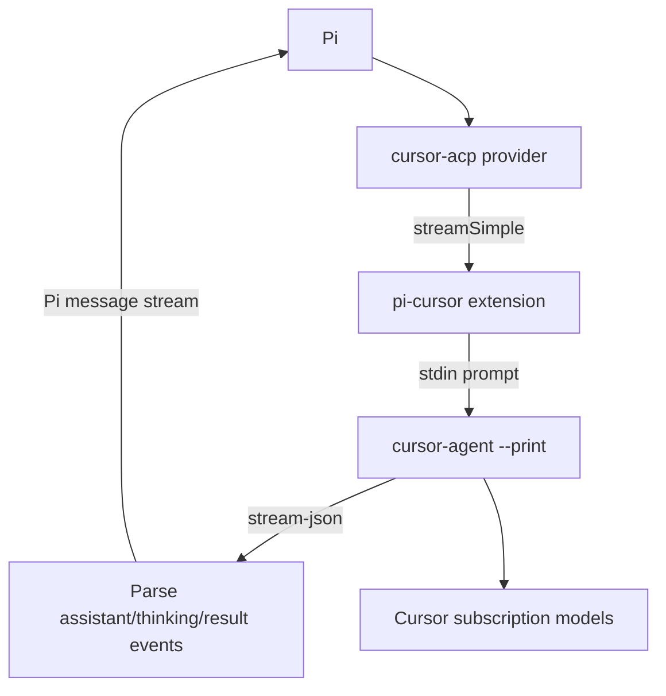

<p align="center">
  
  
  
</p>

No prompt limits. No broken streams. Cursor subscription models in Pi, properly integrated.

## Migration Note

This repository has been migrated from the previous OpenCode package surface to `pi-cursor`:

- npm package: `@xycloud/pi-cursor`; CLI: `pi-cursor`
- global config: `${PI_CODING_AGENT_DIR:-~/.pi/agent}`
- provider: `cursor-acp`
- extension entry: `pi-extension/cursor-acp/index.ts`
- auth remains owned by `cursor-agent login`

The upstream source tree is kept in the repository where possible so future upstream updates remain easy to merge. The published package surface is constrained to the Pi installer, Pi extension, and Cursor model metadata.

## Installation

### Option A — One-line installer

**Linux & macOS:**
```bash
curl -fsSL https://raw.githubusercontent.com/xycld/pi-cursor/main/install.sh | bash
```

**Windows:**
```powershell
npm install -g @xycloud/pi-cursor
pi-cursor install
```

Then authenticate and verify:
```bash
cursor-agent login
pi --offline --list-models cursor-acp
```

### Option B — npm global + CLI

```bash
npm install -g @xycloud/pi-cursor
pi-cursor install
```

Upgrade: `npm update -g @xycloud/pi-cursor && pi-cursor install`

<details>
<summary><b>Option C</b> — Add to Pi config manually</summary>

Add the extension to `${PI_CODING_AGENT_DIR:-~/.pi/agent}/settings.json`:

```json
{
  "extensions": ["/absolute/path/to/pi-cursor/pi-extension/cursor-acp/index.ts"]
}
```

Make sure `${PI_CODING_AGENT_DIR:-~/.pi/agent}/models.json` contains a `cursor-acp` provider. The bundled model list lives at:

```text
pi-extension/cursor-acp/models.json
```

The installer does both updates idempotently and keeps `*.bak.<timestamp>` backups when it changes existing files.
</details>

<details>
<summary><b>Option D</b> — Development (from source)</summary>

```bash
git clone https://github.com/xycld/pi-cursor.git
cd pi-cursor
./install.sh
```

Verify: `pi --offline --list-models cursor-acp`
</details>

<details>
<summary><b>Option E</b> — LLM paste</summary>

```
Install pi-cursor for Pi: clone https://github.com/xycld/pi-cursor, run ./install.sh, authenticate with `cursor-agent login`, then verify with `pi --offline --list-models cursor-acp`. The installer adds the Pi extension path to ~/.pi/agent/settings.json and writes bundled Cursor model metadata into ~/.pi/agent/models.json.
```
</details>

## Authentication

Most users:
```bash
cursor-agent login
```

Check status:
```bash
cursor-agent status
```

Pi does not store Cursor OAuth tokens. Cursor login/session state remains in Cursor Agent.

## Usage

```bash
pi --model cursor-acp/auto
pi --model cursor-acp/sonnet-4.5
```

One-shot smoke test without installing globally:

```bash
pi --no-extensions \
  -e /absolute/path/to/pi-cursor/pi-extension/cursor-acp/index.ts \
  --model cursor-acp/auto \
  --no-tools --no-session --print "Reply with exactly: OK"
```

## Tool Use

The first Pi bridge is intentionally thin: Pi sends the prompt to `cursor-agent --print --output-format stream-json` and streams the response back into Pi.

Cursor Agent can still use its own CLI tools according to its mode and flags. Direct Pi tool-call forwarding and binary/image block passthrough are not part of this first release.

## Architecture



<details>
<summary><b>How the bridge works</b></summary>

`pi-cursor` registers a Pi provider named `cursor-acp`. Model metadata is loaded from Pi's global `models.json` when available, otherwise from the bundled `pi-extension/cursor-acp/models.json` file.

At request time the extension builds a text prompt from the Pi context, runs `cursor-agent --print --output-format stream-json --stream-partial-output`, parses assistant/thinking/result events, and emits Pi provider stream events.

Runtime flags:

- `CURSOR_AGENT_EXECUTABLE` or `CURSOR_AGENT_PATH`: override the `cursor-agent` binary.
- `CURSOR_ACP_FORCE=false`: do not pass `--force` to Cursor Agent.
- `CURSOR_ACP_SANDBOX=enabled|disabled`: pass Cursor Agent sandbox mode.
- `CURSOR_ACP_MODE=plan|ask`: run Cursor Agent in plan/ask mode.
- `PI_CURSOR_MODELS_JSON`: override the model metadata JSON file.
</details>

## Troubleshooting

- Auth errors → run `cursor-agent login`, then `cursor-agent status`.
- Model list is empty → run `pi-cursor install`, then `pi --offline --list-models cursor-acp`.
- `cursor-agent` not found → install Cursor Agent or set `CURSOR_AGENT_EXECUTABLE`.
- Quota exceeded → switch model or check Cursor usage limits/settings.
- Extension not loaded → check `${PI_CODING_AGENT_DIR:-~/.pi/agent}/settings.json` includes the absolute extension path.

Debug one request:
```bash
pi --no-extensions -e /absolute/path/to/pi-cursor/pi-extension/cursor-acp/index.ts \
  --model cursor-acp/auto --no-tools --no-session --print "Reply with exactly: OK"
```

## Roadmap


[X] **Model Load** — Register `cursor-acp` models in Pi
[X] **Streaming Bridge** — Stream `cursor-agent` output into Pi
[ ] **Tool Bridge** — Forward Pi tool calls directly
[ ] **Richer Inputs** — Binary/image block passthrough

## License

BSD-3-Clause
